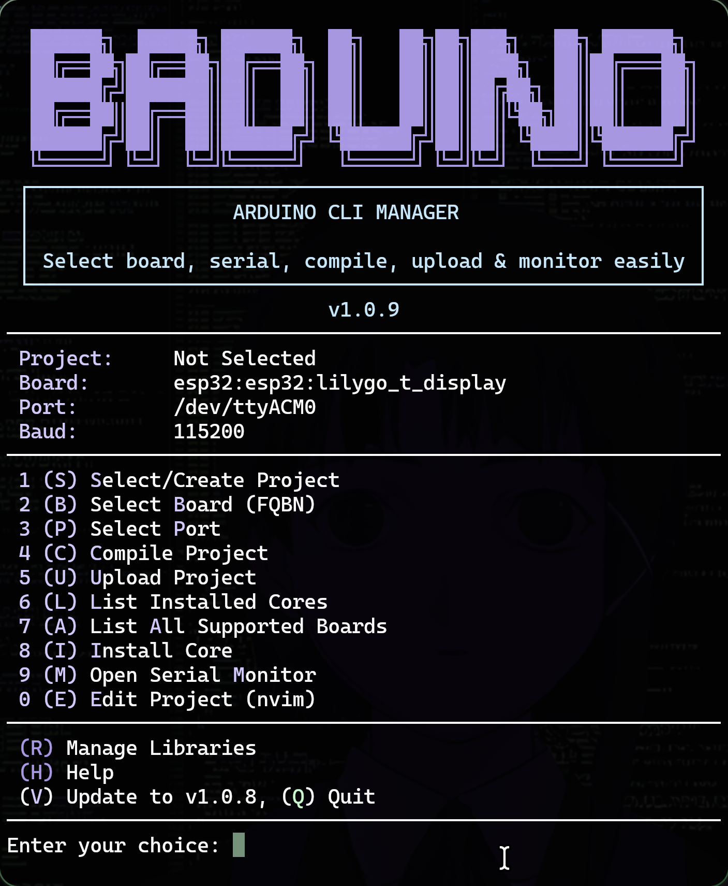

# Arduino CLI Manager

<p align="center">
  
</p>

<p align="center">
  <a href="https://aur.archlinux.org/packages/arduino-cli-manager-git"></a>
  
  
  
  
</p>

---

`arduino-cli-manager` is a **premium, interactive TUI (Terminal User Interface)** designed to simplify Arduino development. It transforms the powerful `arduino-cli` into a vibrant, intuitive experience, allowing you to manage boards, ports, libraries, and projects without touching the documentation.

> [!TIP]
> **Perfect for developers** who live in the terminal and want a high-speed, "no-nonsense" workflow for compiling and uploading sketches.

## Features

- **Rich Terminal UI**: Vibrant color-coded interface with a live dashboard header.
- **Fuzzy Search Integration**: Powered by `fzf` for near-instant selection of boards, ports, and libraries.
- **Smart Project Management**: Create, select, and edit projects (Neovim support) from a single menu.
- **Safe Uploads**: Automatic project backups before every upload (keeps the last 5 versions).
- **Library Manager**: Search and manage Arduino libraries directly from the terminal.
- **Integrated Monitor**: Quick access to the serial monitor for real-time debugging.
- **Operation Logging**: Complete history of your actions with automatic log rotation.
- **Native Arch Linux Support**: Available directly via the AUR.

---

## Installation

### Arch Linux (AUR)
If you are on Arch, this is the recommended way:
```bash
yay -S arduino-cli-manager-git
```

### Global Installation (Any Linux/macOS)
Clone the repository and run the automated installer:
```bash
git clone https://github.com/abod8639/arduino-cli-manager.git
cd arduino-cli-manager
./install.sh
```
*This will install the tool to `~/.local/bin/arduino-manager` and set up a convenient `acm` alias.*

### Manual Install
```bash
chmod +x arduino-cli-manager.sh
# Run locally
./arduino-cli-manager.sh
```

---

## Prerequisites

| Dependency | Purpose | Status |
| :--- | :--- | :--- |
| `arduino-cli` | Core functionality | **Required** |
| `bash` | Script execution | **Required** |
| `fzf` | Interactive fuzzy searching | Recommended |
| `jq` | Update notifications | Recommended |
| `nvim` | Integrated code editing | Optional |

---

## How to Use

Simply type `acm` (if installed globally) or `./arduino-cli-manager.sh` to open the main menu.

### Keyboard Shortcuts
Use these single-key triggers for a lightning-fast workflow:

| Key | Action | Key | Action |
| :---: | :--- | :---: | :--- |
| **S** | Select/Create Project | **U** | Upload Project |
| **B** | Select Board (FQBN) | **C** | Compile Project |
| **P** | Select Port | **M** | Open Serial Monitor |
| **R** | Manage Libraries | **E** | Edit Code (Neovim) |
| **L** | List Cores | **H** | Show Help |

---

## Configuration

The tool maintains its state automatically, but you can customize defaults by editing your local configuration or the script header:
```bash
DEFAULT_FQBN="esp32:esp32:esp32"
DEFAULT_PORT="/dev/ttyACM1"
SKETCH_DIR="$HOME/Arduino"
```

## Troubleshooting

- **Upload Failed?** Check your USB cable and ensure the port (`P`) is correctly selected.
- **Library Missing?** Use the Library Manager (`R`) to search and install missing dependencies.
- **Permission Denied?** Ensure your user is in the `uucp` or `dialout` group (on Linux).

---

## 📜 License & Acknowledgments

Distributed under the **MIT License**. See `LICENSE` for more information.

Built with ❤️ by [Dexter](https://github.com/abod8639)


